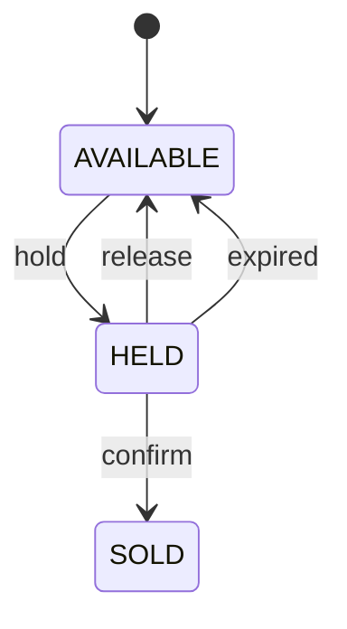
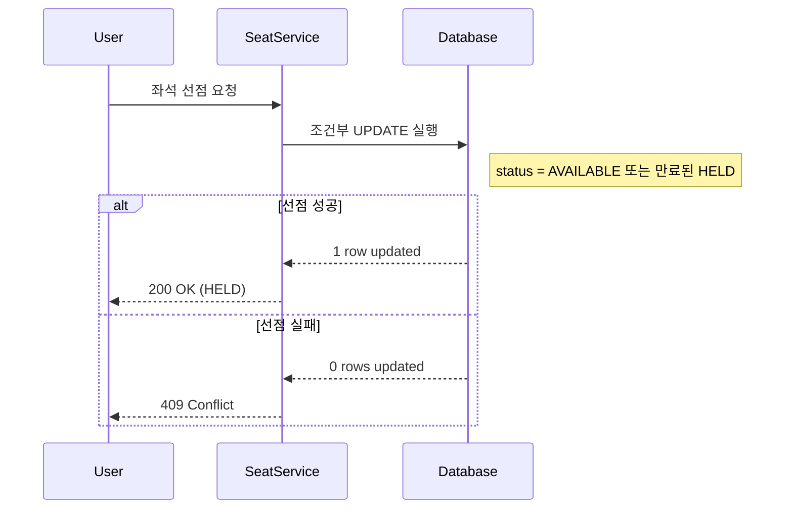
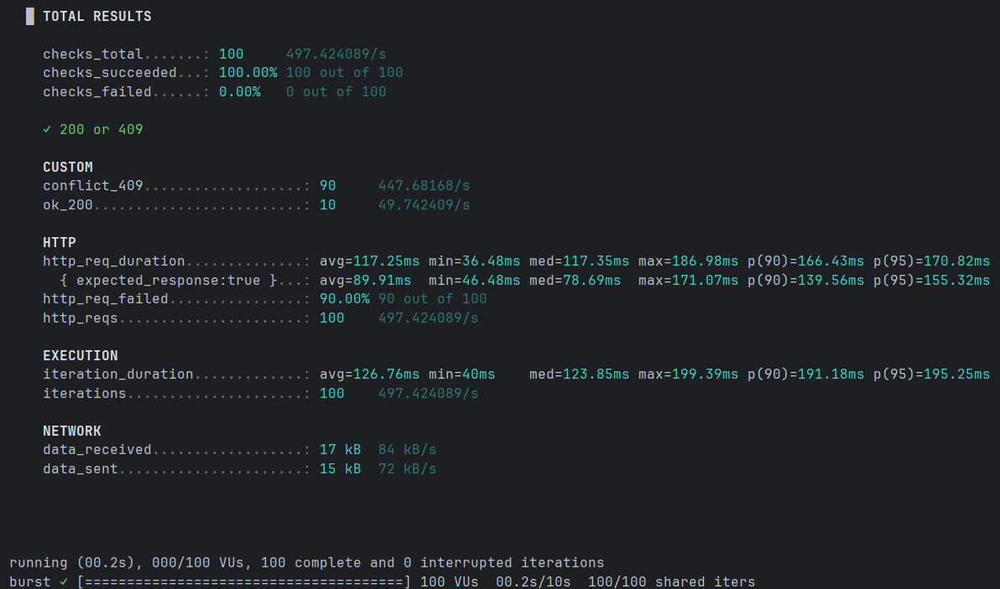
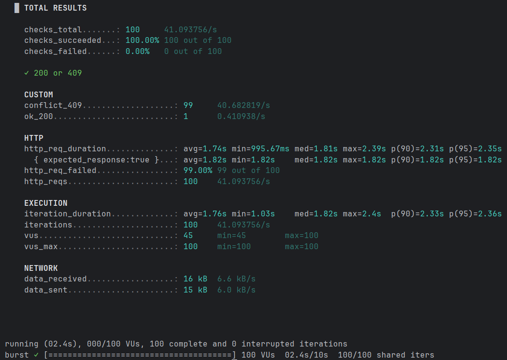

# seat-reservation-api

티켓팅 서비스 흐름을 반영한 좌석 예약 API로, 동시 요청 환경에서 발생하는 중복 선점 문제를 조건부 `UPDATE`와 상태 기반 설계로 개선하고 k6로 검증한 개인 프로젝트입니다.

---

## 프로젝트 개요

- 기간: `2026.02 ~ 2026.03`
- 형태: 개인 프로젝트
- 기술 스택: `Java`, `Spring Boot`, `Spring Data JPA`, `MySQL`, `k6`
- 핵심 주제: 동시성 제어, 데이터 정합성, 상태 기반 설계

## 프로젝트 소개

`좌석 조회 -> 좌석 선점 -> 결제 성공 후 예약 확정` 흐름을 모델링한 좌석 예약 API를 설계하고 구현했습니다.  
핵심 목표는 동시 요청 상황에서도 동일 좌석에 하나의 선점만 발생하도록 제어하는 것이었습니다.

- 티켓팅 서비스에서 자주 발생하는 동시 접속 상황을 직접 구현하고 검증해보고 싶었습니다.
- 단순 CRUD 구현이 아니라 실제 서비스에서 중요한 데이터 정합성 문제를 다루는 프로젝트를 만들고자 했습니다.

## 기술 스택

### Backend

- Java
- Spring Boot
- Spring Data JPA

### Database

- MySQL

### Testing

- k6

---

## 주요 기능

- `AVAILABLE`: 예약 가능한 상태
- `HELD`: 좌석을 임시 선점한 상태
- `SOLD`: 결제 성공 이후 예약이 확정된 상태
- 동일 좌석에 대한 동시 요청이 들어와도 하나의 요청만 선점되도록 처리
- `holdToken`과 `holdExpiresAt`을 활용해 선점 사용자와 만료 시간을 관리
- 선점한 사용자만 좌석을 확정할 수 있도록 처리
- 결제 실패 또는 사용자 취소 시 `HELD` 상태를 해제하고 `AVAILABLE`로 복구
- 만료된 `HELD` 좌석은 다시 예약 가능하도록 처리
- 스케줄러를 통해 만료된 선점 상태를 주기적으로 정리

---

## 상태 전이



---

## 주요 API

| Method | Endpoint | Description |
| --- | --- | --- |
| GET | `/sections/{sectionId}/seats` | 좌석 목록 조회 |
| POST | `/sections/{sectionId}/seats/{seatId}/hold` | 좌석 선점 요청 |
| POST | `/sections/{sectionId}/seats/{seatId}/confirm` | 좌석 예약 확정 |
| POST | `/sections/{sectionId}/seats/{seatId}/release` | 좌석 선점 해제 |

## 문제 상황

초기 구현은 `조회 -> 상태 확인 -> 상태 변경` 구조였습니다. 이 방식에서는 여러 요청이 동시에 같은 좌석을 `AVAILABLE` 상태로 읽을 수 있어, 동일 좌석에 여러 선점이 발생하는 Race Condition 문제가 있었습니다.

---

## 해결 방법

좌석 상태 확인과 상태 변경을 분리하지 않고, DB 조건부 `UPDATE`로 한 번에 처리하도록 변경했습니다.  
즉, 애플리케이션에서 먼저 읽고 판단하는 대신 DB가 조건 검사와 상태 변경을 원자적으로 처리하도록 설계했습니다.

핵심 조건은 다음과 같습니다.

- `status = AVAILABLE`이면 선점 가능
- `status = HELD`여도 `hold_expires_at < now`이면 다시 선점 가능

```sql
UPDATE seats
SET status = 'HELD', hold_token = ?, hold_expires_at = ?
WHERE id = ?
  AND (
    status = 'AVAILABLE'
    OR (status = 'HELD' AND hold_expires_at < ?)
  );
```

추가로, 만료된 `HELD` 좌석이 계속 남지 않도록 스케줄러를 도입해 주기적으로 정리했습니다.

### 좌석 선점 처리 흐름


---

## 검증

### 개선 전


### 개선 후


- 테스트 도구: k6
- 대상 API: `POST /sections/{sectionId}/seats/{seatId}/hold`
- 테스트 조건: 동일 좌석 100명 동시 요청
- 개선 전: `200 성공 10건 / 409 충돌 90건`
- 개선 후: `200 성공 1건 / 409 충돌 99건`
- 총 요청 수: `100`

이미 선점된 좌석에 대한 요청은 `409 Conflict`로 반환되도록 처리했습니다.

동시 요청 환경에서도 동일 좌석에 대해 하나의 선점만 성공하도록 제어되는 것을 확인했습니다.

---

## 주요 구현 내용

- 좌석 조회, 선점, 예약 확정 흐름 설계 및 구현
- 중복 선점 문제를 Race Condition으로 분석
- 조건부 `UPDATE` 기반 선점 로직 적용
- `AVAILABLE`, `HELD`, `SOLD` 상태 모델 설계
- 만료 좌석 정리를 위한 스케줄러 적용
- k6 기반 동시성 부하 테스트 수행

---

## 배운 점

- 단일 요청에서는 정상 동작하는 구조라도 동시 요청 환경에서는 전혀 다른 문제가 발생할 수 있다는 점을 직접 확인했습니다.
- 동시성 문제는 애플리케이션 로직만이 아니라 DB 레벨 설계까지 포함해 다뤄야 한다는 점을 배웠습니다.
- 구현이 끝났다고 문제가 해결된 것이 아니라, 실제 동시 요청 환경에서 검증해야 한다는 기준을 갖게 되었습니다.
- 복잡한 기술을 무리하게 도입하기보다 현재 프로젝트 목적과 규모에 맞는 해결책을 선택하는 것이 중요하다는 점을 배웠습니다.

---

## 향후 개선 계획

- confirm 동시성 테스트 추가
- `sectionId`와 `seatId`의 소속 관계 검증 강화
- 인덱스 튜닝 및 `EXPLAIN` 분석
- 예외 처리 공통화(`@RestControllerAdvice`)
- 결제 도메인 분리 및 모킹 고도화
- 대기열 기반 예약 구조 추가
- 더 큰 트래픽 환경을 가정한 확장 테스트
- 다른 동시성 제어 방식과의 비교 검토
